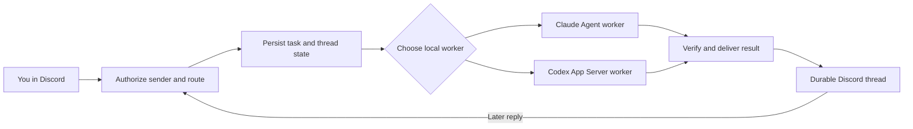

# Disco Party


## Your AI agents already live on your computers. Disco Party gives them a front door.

Leave your Mac running at home. Open Discord from your phone. Ask Claude Code to investigate a failing build or send Codex into a local repository. The work happens on your machine, and the updates return to a durable Discord thread you can follow from anywhere.

Disco Party is an orchestrator for Claude Code and OpenAI Codex. It receives requests, checks who sent them, records them, routes each task to the right local agent, preserves the conversation, and brings the result back to Discord. It does not replace either model. It turns the subscriptions and computers you already have into an always-available system you can operate remotely.


### What you get

- Remote access to agents running on your Mac or local repository from your phone or another computer.
- Claude Code and Codex through the subscriptions you already pay for. The Codex path uses OpenAI's official ChatGPT sign-in and App Server, with no manually supplied OpenAI API key.
- One durable Discord thread per task, so every request, follow-up, status update, and result stays together.
- Local memory that survives a dropped Discord connection, restarted worker, or resumed conversation.
- Parallel work without freezing the front door. The orchestrator remains available while independent tasks run.
- A shared workspace that lets Claude and Codex pick up artifacts from each other without pretending their private model sessions are one conversation.

## What an orchestrator actually does

A chatbot answers the message in front of it. An orchestrator manages the whole journey around the message.



For every accepted message, Disco Party:

1. Receives a pushed Discord event. Normal operation is event driven, not a cron poller.
2. Verifies the exact server, channel, bot, application, owner, event type, and policy.
3. Creates or recovers a public Discord thread and saves the routing state locally.
4. Dispatches the task without tying up the listener.
5. Keeps replies for one thread ordered while allowing independent threads to progress concurrently.
6. Resumes the correct Claude or Codex conversation when you reply later.
7. Reconciles uncertain delivery after restarts instead of blindly repeating work.

The two providers implement the worker layer differently:

| Provider | How orchestration works | Local runtime | Authentication |
| --- | --- | --- | --- |
| Claude Code | One interactive listener records the request, then dispatches the work to a background Claude Agent subagent. The listener stays responsive. | `discoparty-chat` tmux session | Existing Claude Code subscription login |
| Codex | A headless service places accepted work in SQLite, then a bounded pool of official Codex App Server workers creates or resumes Codex threads. Work is parallel across Discord threads and serial within each thread. | macOS LaunchAgent, plus optional read-only tmux monitor | Isolated Sign in with ChatGPT, no manually supplied API key |

Codex subagents are disabled in this release because the bridge cannot yet attest their child lifecycle. The worker pool provides safe concurrency without claiming a security property the bridge cannot prove.

## Why Discord is the interface

SSH gives you a terminal. Disco Party gives you an operating log.

Discord already has mobile apps, notifications, channel controls, threaded replies, search, and a UI that works from nearly any computer. Disco Party uses those primitives as a remote command center for machines you control.

A Discord thread becomes the durable record of one task: what you asked, which agent and machine owned it, what happened next, every follow-up, and the final result. That makes Discord an additional context source for your second brain. You can keep all coordination in Discord, or let both providers work against a shared local workspace and hand off through files and artifacts.

## What this looks like in real life

### Run a task from your phone

You are away from your desk when a build breaks. Post the error in the Claude channel. Disco Party opens a thread, sends the task to the Mac at home, and returns the investigation to the same thread. Reply with the next instruction without reopening a terminal.

### Give long work its own lane

Start a repository audit in the Codex channel and a documentation rewrite in the Claude channel. The orchestrator keeps each conversation attached to its own thread and allows independent work to proceed concurrently.

### Hand work from Claude to Codex

Ask Claude to create a plan in the shared workspace. Then ask Codex to implement or review that artifact. Their model sessions stay separate, but the durable file and Discord history give the second agent a concrete handoff point.

### Control more than one computer

Use one Discord server as the command center for a home Mac, a work Mac, or additional local runtimes. Give every machine and provider its own bot, channel, and state directory, such as `#claude-work-mac` and `#chatgpt-home-m5`.

Do not connect several machines to the same bot and channel. Two consumers could accept the same event and perform the work twice. The safe current pattern is one Discord server with one dedicated bot, channel, and runtime for each provider and machine.

## Memory without pretending the agents share a brain

Claude and Codex do not share credentials or silently merge model sessions.

- Claude stores an append-only Markdown transcript and maps each Discord thread to a local session.
- Codex stores jobs, delivery state, persisted Codex thread IDs, and Discord mappings in SQLite.
- Both may use the same intentional workspace, so one provider can pick up an artifact created by the other.
- Discord can remain the complete coordination surface if you do not want a shared workspace handoff.

This gives you continuity at the orchestration layer while preserving explicit provider boundaries.

## Get started

### Claude Code

```sh
git clone https://github.com/vp58/discoparty.git ~/.discoparty
cd ~/.discoparty
python3 -m pip install -r requirements.txt
bash install.sh
```

The installer stores the Discord bot token in macOS Keychain and starts the interactive `discoparty-chat` listener.

### Add Codex on the reviewed M5 Max host

```sh
cd ~/.discoparty
bash install-codex.sh
```

The current Codex installer intentionally requires an Apple M5 Max. It pins the reviewed native Codex CLI, model, schema, App Server request set, and runtime hashes. Other Macs and Linux are not supported by this Codex installer today.

The installer creates a second Discord bot and channel, installs the `com.discoparty.codex-discord-bridge` LaunchAgent, and opens an isolated official ChatGPT browser sign-in. The service then runs headlessly. You do not need to leave a Codex terminal open.

Read the [setup guide](docs/SETUP.md) before enabling Codex. OpenAI documents the upstream pieces in [Codex authentication](https://learn.chatgpt.com/docs/auth), [Codex App Server](https://learn.chatgpt.com/docs/app-server), and the [`gpt-5.6-sol` model page](https://developers.openai.com/api/docs/models/gpt-5.6-sol).

## First test

Post this from the configured owner account in the correct provider channel:

```text
Inspect this repository and tell me the three highest-leverage improvements. Do not change anything.
```

A successful run has four visible proofs in Discord:

1. The bot adds an eyes reaction.
2. A public thread appears under the message.
3. The worker replies inside that thread.
4. A later reply resumes the same local agent conversation.

For Claude, attach to the real interactive listener with `tmux attach -t discoparty-chat`. For Codex, `tmux attach -t discoparty-codex` opens a read-only monitor. Closing the Codex monitor does not stop the LaunchAgent.

## Security posture

Disco Party connects untrusted internet messages to agents that can touch a real computer. The security model starts there.

The default design uses exact owner ID checks, dedicated bots and channels, minimal Discord permissions, macOS Keychain credentials, durable idempotent delivery, bounded queues, isolated Codex state, reviewed configuration, policy fingerprints, and fail-closed drift checks. Public channels control who can read the work. They do not expand who can trigger it.

The default Codex profile limits writes to the configured workspace and disables agent network access. An operator may explicitly choose full computer access, but that is same-user authority, not containment. Official Codex Hooks are supported-path guardrails and can fail open if the hook framework or process fails. A public channel is never appropriate for secrets, private records, regulated data, or confidential source material. Output redaction is best effort and is not a confidentiality boundary.

Before installation, read the [security model](docs/SECURITY.md), [security board review](docs/SECURITY_REVIEW_2026-08-29.md), [architecture](docs/ARCHITECTURE.md), and [FAQ](docs/FAQ.md).

## What is proven today

Disco Party began as a private Claude orchestrator that has run unattended since May 21, 2026. The public Claude installation path followed on May 23, 2026. The M5 Max Codex bridge has passed its live Discord acceptance flow, installer and uninstaller smoke tests, and the repository test suite across Python 3.11, 3.12, and 3.13 in GitHub Actions.

The project is still pre-release. The Codex integration uses an official OpenAI interface that OpenAI currently marks [experimental](https://developers.openai.com/codex/cli/reference). Disco Party therefore pins the reviewed Codex CLI `0.151.0`, `gpt-5.6-sol`, OpenAI provider, Ultra reasoning, native binary hashes, schema bundle, and request set. A newer CLI is rejected until those surfaces are reviewed and the live acceptance flow passes again.

## Current platform support

| Provider | Supported host | Service model | Current status |
| --- | --- | --- | --- |
| Claude Code | macOS installer; Linux service templates are included | Interactive listener plus background Agent workers | Original and longest-running path |
| Codex | Exact Apple M5 Max on macOS 26.6.2, arm64 | Headless LaunchAgent plus three App Server workers by default | Opt-in, reviewed, pre-release |

## Project map

- [Setup](docs/SETUP.md): create bots and channels, install each runtime, verify the live Discord flow, and review upgrades.
- [Architecture](docs/ARCHITECTURE.md): orchestrator responsibilities, provider lifecycles, durable state, concurrency, and recovery.
- [Security](docs/SECURITY.md): threat model, trust boundaries, sandboxing, approvals, output controls, and limitations.
- [Security board review](docs/SECURITY_REVIEW_2026-08-29.md): findings, verification evidence, accepted risks, and release gates.
- [Implementation inventory](docs/IMPLEMENTATION_INVENTORY_2026-08-29.md): exact implementation surface and rationale.
- [FAQ](docs/FAQ.md): plain-language and technical answers about both providers.
- [Contributing](CONTRIBUTING.md): issue flow, pull requests, and code style.

## Why this exists

The useful computer is often the one you are not sitting in front of.

Coding agents became capable enough to own long tasks, but access still revolved around an open terminal on one machine. Disco Party turns Discord into the remote control and durable memory layer around those agents. The orchestrator keeps the front door available, routes work to the right local runtime, and preserves enough state to continue after the moment that started the task.

If that model is useful to you, star the repository, install the provider you already use, and help extend the orchestrator to more reviewed machines and agents.

## License

MIT. See [LICENSE](LICENSE).

## Changelog

See [CHANGELOG.md](CHANGELOG.md).

## Acknowledgments

Disco Party began as a public extraction of the private `cx-chat` Claude orchestrator. The Codex provider keeps the same durable Discord conversation model through a separate runtime built on OpenAI's official App Server.
