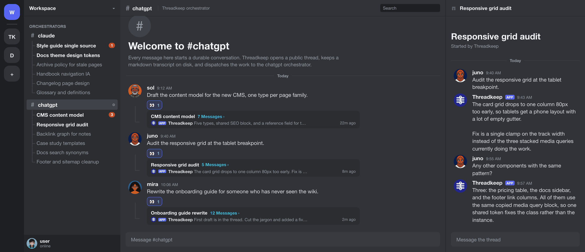

# Threadkeep


**Run Claude Code and OpenAI Codex from Discord using the subscriptions you already pay for.** Threadkeep pipes each agent into its own Discord bot and channel, keeps durable local task memory, and lets either agent pick up the other's work through shared workspace context. If you prefer, Discord threads can remain the complete coordination surface.



Threadkeep can run either provider or both. Each provider owns a separate Discord bot, channel, runtime, authentication path, and model session. Claude uses your Claude Code subscription login. Codex uses your ChatGPT subscription login through OpenAI's official Codex App Server, with no manually supplied OpenAI API key. Durable conversation records and the shared local workspace preserve context without silently mixing provider credentials or sessions.

Contributions welcome. See `CONTRIBUTING.md` for the PR flow, issue templates, and code style.

| Provider | Discord path | Local runtime | Model authentication | Default authority |
| --- | --- | --- | --- | --- |
| Claude Code | Claude bot in `#chat` | Interactive Claude Code listener in `threadkeep-chat` tmux, plus background workers | Existing Claude Code subscription login | Normal Claude Code permission prompts |
| Codex | Codex bot in `#chatgpt` | Headless LaunchAgent using the official Codex App Server | Isolated Sign in with ChatGPT, no manually supplied OpenAI API key | Custom `threadkeep-workspace-only` profile |

The channel names are recommendations and routing uses immutable IDs. The separation is intentional, but it is not operating-system isolation. Both providers run as the same macOS user. Codex keeps the user's canonical macOS `HOME` so the official CLI can use the default Keychain, while Threadkeep supplies a private `CODEX_HOME`, reviewed policy config, and separately scoped ChatGPT login below its state directory instead of reusing `~/.codex`. Full computer access is available only after the exact risk acceptance, independently of whether the destination is public or private, and remains uncontained because official Hooks can fail open when the hook framework or process fails.

## Contents

- [Install](#install)
- [First walkthrough](#first-walkthrough)
- [How the providers work](#how-the-providers-work)
- [Features](#features)
- [Status](#status)
- [Architecture](#architecture)
- [Configuration](#configuration)
- [Run from source](#run-from-source-developers)
- [Security](#security)
- [Documentation](#documentation)

## Install

Install the original Claude provider:

```sh
git clone https://github.com/vp58/threadkeep.git ~/.threadkeep
cd ~/.threadkeep
python3 -m pip install -r requirements.txt
bash install.sh
```

The Claude installer remains the default and does not require Codex configuration. It stores the Claude Discord bot token in macOS Keychain and starts the `threadkeep-chat` listener.

To add the Codex provider after the base install:

```sh
cd ~/.threadkeep
bash install-codex.sh
```

The Codex installer is separate because it needs a second Discord application and bot, a second public channel, and an isolated ChatGPT sign-in. It installs the `com.threadkeep.codex-discord-bridge` LaunchAgent and opens the official browser login when its private Codex home is not already authenticated. See [the full setup guide](docs/SETUP.md) before enabling the Codex provider.

Uninstall only Codex with `bash uninstall.sh --codex`. Uninstall the original Claude services with `bash uninstall.sh`. The provider-specific Codex removal stops the service and performs an official logout scoped to Threadkeep's isolated `CODEX_HOME`; `--keep-chatgpt-login` is an explicit opt-in for retaining that Keychain login. Claude, `config.toml`, Codex noncredential state, and service logs remain for audit or reinstall. Delete retained state and logs manually if they must also be removed.

## First walkthrough

### Claude

Post this in the configured Claude channel:

```text
Make a tiny checklist for testing Threadkeep.
```

Expected result:

1. The Claude listener reacts to the message.
2. A public Discord thread appears under the message.
3. A markdown conversation file is created under the configured workspace.
4. A Claude worker replies in the thread.
5. A later thread reply is dispatched with the prior transcript.

If nothing happens, attach to the interactive listener with `tmux attach -t threadkeep-chat` and inspect `discord-gateway/logs/client.log`.

### Codex

Post the same request from the configured owner account in the separate Codex channel.

Expected result:

1. The Codex bot adds an eyes reaction.
2. A public Discord thread appears under the message.
3. A durable job is recorded in the Codex SQLite ledger.
4. The headless App Server turn runs and the bot replies in the thread.
5. A later owner reply in that managed thread resumes the corresponding Codex conversation.

The Codex service does not depend on an open terminal. To observe it locally, use `tmux attach -t threadkeep-codex`. That tmux session is a read-only monitor, not the worker.

## How the providers work

### Claude provider

The Claude Code Discord plugin feeds a single interactive listener. Its per-channel allowlist accepts only the exact configured owner and its direct-message allowlist is empty. The listener records each conversation as markdown and dispatches work to a background Agent subagent. It stays responsive while workers run. Native Approve and Reject buttons record exact owner review evidence, but Threadkeep does not install or run a third-party outbound adapter.

### Codex provider

The Codex bridge receives Discord `MESSAGE_CREATE` events through a persistent Gateway connection. It accepts work only when the immutable guild, channel, owner, bot, application, event type, message type, and policy version all match. Webhooks, bots, empty messages, and every other user are rejected.

Accepted events enter a private SQLite job ledger. The worker creates or resumes a Codex thread through OpenAI's official App Server, submits the turn, filters the public response, and delivers it to Discord with a durable attempt marker, idempotency nonce, and content readback. A reconnect uses Gateway resume when possible and reconciles messages after a durable per-channel cursor. It is event driven, not a cron poller.

Gateway socket reads and heartbeats stay separate from the serial REST and SQLite ingress dispatcher. Dispatches enter a bounded queue, and queue exhaustion aborts the socket so launchd can reconnect and reconcile from durable cursors instead of starving Discord heartbeats. A separate bounded pool runs up to three App Server workers by default. Work for one Discord thread remains serialized, while independent threads may progress concurrently.

## Features

- Run Claude, Codex, or both without sharing Discord applications, bots, tokens, channels, or guild memberships. The Codex bot is dedicated to exactly one configured server.
- Top-level messages create public threads. Replies stay attached to the correct local conversation.
- Claude conversations use durable markdown transcripts and a JSON registry.
- Codex jobs, sessions, cursors, leases, delivery manifests, and delivery nonces use a durable SQLite ledger.
- A retry inside Discord's short nonce window reuses the same nonce. An older unresolved POST searches the complete destination history for an exact bot, nonce, and content match. If none can be proved, the chunk is quarantined and is not posted again.
- Codex durable jobs, managed threads, session scopes, and delivery manifests are bound to a fingerprint of the Discord IDs, workspace, sandbox, model policy, ChatGPT `account/read` binding, sealed Vault P0 policy, exact shared-skill closure, built-in and optional trusted instructions, and binary and schema pins.
- Claude keeps its interactive `threadkeep-chat` tmux workflow.
- Codex runs headlessly under launchd, with an optional read-only `threadkeep-codex` monitor.
- Codex uses an isolated ChatGPT subscription login and refuses API-key authentication.
- Codex binds durable routing to a domain-separated hash of the nonsecret email and plan facts returned by official App Server `account/read`, without logging the email.
- Codex uses the exact macOS Keychain credential backend. A filesystem `auth.json`, backup, temporary credential file, API-key mode, missing ChatGPT email, or unexpected authentication layer fails closed.
- Codex mechanically seals the six canonical Vault P0 sections from `CLAUDE.md` into a private read-only snapshot, binds both source and snapshot hashes into policy state, and revalidates them before and after every turn. It does not keep a second prose copy.
- Codex runs three isolated App Server worker slots by default, configurable from one through four. The SQLite claim transaction allows parallel independent destinations and forbids overlap for the same Discord thread, including unresolved uncertain work.
- Codex uses a private, immutable, version-identified Python runtime with hash-verified dependencies and does not auto-load workspace `AGENTS.md` or fallback project documents.
- Codex pins the official native arm64 Codex CLI `0.151.0`, `gpt-5.6-sol`, the OpenAI provider, and Ultra reasoning with fallback disabled.
- Both Codex authority modes keep project roots untrusted and reject custom provider endpoints, project config, exec policy, ambient MCP servers, apps, plugins, bundled skills, skill search, multi-agent, every unreviewed hook, and every skill except the exact canonical Vault skills described below. Multi-agent remains disabled because the bridge cannot attest descendant lifecycle and hook events.
- Codex derives the canonical Vault security validator, em dash write validator, outbound-send guard, and helper closure into a private read-only runtime snapshot outside every writable root. Its isolated `hooks.json` points only to that snapshot. Threadkeep runs the outbound guard in deny-only mode, binds source and snapshot hashes separately from Codex's hook-definition hash, verifies exact `hooks/list` metadata, and watches synchronous hook results. These hooks are guardrails for supported local tool paths, not an operating-system or outbound authorization boundary.
- Codex hash-binds the canonical Vault `eli5`, `marketing/websites/vinaytalks`, `triage`, and `skill-finder` closures. ELI5 requests inject ELI5 and VinayTalks, asset or artifact creation injects VinayTalks, triage requests inject triage, and skill-finder is injected on every turn for general Vault routing. Danger-full-access mode also injects the hash-bound canonical `CLAUDE.md` bootstrap from outside the isolated working directory. Skill-finder may then read the broader live Vault library through full shell access, but those discovered files are not part of the four-skill manifest and remain exposed to accepted same-user mutation risk.
- App Server config validation accepts only the reviewed session-flags layer, disabled project layers from canonical `.codex` ancestors inside the untrusted Git root, the exact isolated user layer, and an empty `/etc/codex/config.toml` system layer. Managed, MDM, enterprise, legacy, packaged, active project, duplicate, or reordered layers fail closed. The effective shell environment cannot inject variables, and the safe profile is rechecked down to its root-deny and network-off rules.
- The `workspace-write` compatibility setting selects a custom root-deny, agent-network-off permission profile and additionally disables web search, browser and computer use, image generation, multi-agent, and local automation.
- `danger-full-access` is available after the operator supplies the exact full-computer-access acknowledgment. Execution authority is independent of destination trust, so a public `#chatgpt` channel may use it. It grants same-user shell, filesystem, process, and command-network authority. Codex `0.151.0` Hooks remain supported-path guardrails and can fail open, so this mode is an explicit owner risk acceptance, not a containment claim.
- Preflight calculates the bot's effective Discord permissions, requires exactly the operational capabilities, rejects extra guild-management and channel-content capabilities, and rechecks permission drift while the service runs. The `@everyone` channel overwrite must explicitly deny Manage Threads, Create Public Threads, and Create Private Threads. Only the configured bot's exact member overwrite may restore Create Public Threads; role and other-member restorations fail closed.
- Optional `owner_private` trust requires a truly private parent channel: `@everyone` explicitly denied View Channel, exact member View Channel allows for the configured guild owner and dedicated bridge, no other role or member View allow, and no other effective reader. Permission or audience proof failure terminates the bridge and cancels every worker.
- Guild-channel and active-thread enumeration requires the Codex bot to have View Channel only on configured `#chatgpt`, its declared parent category when present, and active public child threads beneath it. Visibility into any other channel, category, private thread, announcement thread, or unrelated public thread fails closed. The narrow parent-category exception exposes category metadata, not messages.
- Codex output is redacted rather than discarded. Credentials and Luhn-valid payment-card numbers are masked on a best-effort pattern basis. Public mode also attempts to mask personal values and structured private details, but this DLP is not a confidentiality boundary and may miss or partially expose sensitive material. `owner_private` may preserve requested personal data only after Threadkeep proves that the parent channel is readable solely by the guild owner and dedicated bridge. Discord mentions are disabled.
- Claude retains native Discord Approve and Reject buttons for exact owner review, but no outbound sender is installed and an approval reference alone is not an authorization capability.
- Codex denies interactive App Server approval requests. Trusted instructions require a later owner-authenticated message that explicitly approves the exact draft or action manifest.
- Persistent Discord IDENTIFY budgets survive Codex service restarts. RESUME does not consume that local budget.
- A private readiness marker exists only while both the verified Gateway path and App Server worker are ready. Installer bootstrap waits for a fresh marker instead of treating a loaded LaunchAgent as success.
- macOS launchd support, with the original Claude-oriented Linux templates retained.

## Status

Pre-release.

The original private Claude deployment has run unattended since 2026-05-21. The public Claude install path was added on 2026-05-23 and tested by the original author. The Codex provider is newer and uses an experimental official OpenAI interface. Treat it as opt-in until its public install path has broader field coverage.

The Codex integration pins official Codex CLI `0.151.0`, its native arm64 binary hash, launcher hash, generated experimental schema bundle, and server request set. It also requires [`gpt-5.6-sol`](https://developers.openai.com/api/docs/models/gpt-5.6-sol) with Ultra reasoning. A newer Codex CLI is not accepted automatically. Follow the documented review process and the official [Codex changelog](https://learn.chatgpt.com/docs/changelog) before changing the pin.

## Tested on

- Claude provider: macOS 26.4 (Tahoe), Python 3.14.3, websockets 16.0
- macOS 15 (Sequoia) and macOS 14 (Sonoma) are expected to work but are not regularly tested
- Codex provider: Apple M5 Max, macOS 26.6.2, arm64, Codex CLI `0.151.0`; the installer requires the exact `Apple M5 Max` chip value and pins the reviewed binary path and hashes
- Linux: the existing Claude-oriented systemd templates are shipped, but `install.sh` is macOS-specific and the Codex LaunchAgent path is not a Linux installer

## Architecture

```text
Claude channel -> Claude Discord plugin -> interactive listener tmux
                                         -> markdown transcript -> Agent worker

Codex channel  -> dedicated Discord Gateway -> exact owner ingress filter
                                           -> SQLite job ledger
                                           -> headless Codex App Server
                                           -> public-output filter -> Discord thread

Claude approval buttons -> approval router -> verified review reference
                                          -> no automatic outbound sender
```

The providers have separate routing and state paths: channels, bot identities, bot tokens, model sessions, and conversation stores. They still share the authority available to the logged-in host account. See [the architecture guide](docs/ARCHITECTURE.md) for lifecycles and failure handling.

## Configuration

Shared and Claude configuration lives in `config.toml` under `[paths]`, `[discord]`, and `[runtime]`. The optional Codex provider lives under `[codex]`.

The two Discord tokens use separate macOS Keychain accounts:

| Provider | Keychain service | Keychain account |
| --- | --- | --- |
| Claude | `threadkeep-secret` | `discord-bot-token` |
| Codex | `threadkeep-secret` | `discord-bot-token-codex` |

Keychain is the source of truth for both tokens. Do not manually put either token in `config.toml`, an environment file, a plist, a shell history entry, or the repository. Public identifiers and non-secret overrides can use the environment variables documented in `.env.example`.

The [official Claude channels documentation](https://code.claude.com/docs/en/channels) accepts `DISCORD_BOT_TOKEN` through the process environment. Immediately before each Claude launch, Threadkeep validates the plugin policy and private state, reads the token from Keychain with environment fallback disabled as its final credential step, then replaces the wrapper with the pinned Claude process. The token exists only in that process environment, never in argv or on disk. Any stale `~/Library/Application Support/Threadkeep/claude-discord/.env` blocks launch; controlled install and uninstall remove it. A same-user process may still inspect process memory or environment, so Keychain and private state are not a same-user security boundary.

The separate Keychain accounts prevent accidental replacement, but they are not a same-user security boundary. Preflight compares the Codex token with any standard Claude token source it can discover. If the Claude token uses a custom source, the operator must verify separation.

New Codex installations default the state directory to `~/Library/Application Support/Threadkeep/codex-discord`, outside the documented `~/.threadkeep` repository clone. An override must be an explicit subpath below the canonical `~/Library/Application Support/Threadkeep` root. Arbitrary existing state paths are rejected. The installer and daemon independently repeat canonical-path, ownership, mode, real-directory, and symlink checks. This keeps auth and App Server rollouts out of another Git checkout or synced working tree. The installer creates `state_dir/home/.codex` as private `CODEX_HOME`, writes a reviewed mode `0600` policy config, and performs the official [ChatGPT browser login](https://learn.chatgpt.com/docs/auth) with the real canonical macOS `HOME` so the CLI can reach the default Keychain. Normal `~/.codex` credentials and configuration are not loaded. Threadkeep verifies ChatGPT authentication before and after App Server initialization, and it does not pass `OPENAI_API_KEY` or either Discord token to the child environment.

The isolated config requires `forced_login_method = "chatgpt"`, exact `cli_auth_credentials_store = "keyring"`, and disabled filesystem secret storage. Threadkeep rejects any `auth.json` or sibling credential artifact before and after login checks, App Server initialization, principal reads, turns, and refresh handling. It requires official `codex login status` plus App Server `account/read`, then binds a domain-separated hash of the returned nonsecret email and plan to durable routing without logging the email. This proves which locally authenticated ChatGPT principal App Server reports; the official Codex client and OpenAI service still own upstream credential verification.

The installer creates or reuses `state_dir/runtime-venv-cpython-<major.minor>-websockets-<version>-<lock-sha256>` from the versioned `requirements-macos-arm64.lock`. A new runtime is built in a private staging directory with required hashes and binary-only wheels, verified against installed-distribution records and its private manifest, then published atomically without replacing an existing path. The LaunchAgent uses that exact private Python executable. This reduces dependency drift but is not same-user isolation.

The default Codex limits are 5 accepted messages per minute, 30 per hour, 3 concurrent workers, 100 pending jobs, 12,000 input characters, 30 days of retention for completed, failed, cancelled, and eligible old uncertain jobs, and 268,435,456 bytes of logical SQLite capacity. Worker concurrency is configurable from 1 through 4 under `[codex]`; the other limits are configurable there as documented. Admission and delivery fail closed at their applicable limits. Retention and capacity cover the Threadkeep SQLite ledger only. Persisted Codex App Server thread and rollout state under the isolated `CODEX_HOME` can live longer and grow separately.

## Run from source (developers)

```sh
git clone https://github.com/vp58/threadkeep.git
cd threadkeep
python3 -m pip install -r requirements.txt
python3 -m unittest discover -s discord-gateway/tests -t discord-gateway -v
PYTHONPATH=. python3 -m unittest discover -s codex-discord/tests -v
bash codex-discord/tests/test_install_codex.sh
```

Run the Codex preflight before starting its service:

```sh
PYTHONPATH=. python3 -m codex_discord_bridge.preflight
```

The service entry point is:

```sh
PYTHONPATH=. python3 -m codex_discord_bridge.main
```

Use the installer for normal operation so launchd, Keychain, paths, and logs are set consistently. Do not export bot tokens by hand for routine use.

## Security

- Treat every Discord message, attachment, linked page, and third-party result as untrusted input.
- Keep Claude and Codex on separate bots and channels.
- Keep the Codex application and bot dedicated to one server. Gateway READY fails unless the bot's guild inventory is exactly the configured guild.
- Deny the Codex bot View Channel outside `#chatgpt`, its declared parent category when present, and active public child threads beneath it. Preflight and runtime enumeration fail closed if Discord exposes any unrelated guild channel, category, or active thread to the bot.
- Codex ingress is owner-only. A public channel controls visibility, not who may start work.
- Keep the writable Codex workspace separate from the Threadkeep repository, `config.toml`, state directory, logs, LaunchAgent plist, trusted instruction file, and canonical shared-skill source. Otherwise Codex can modify its own control plane or future trusted inputs.
- Optional trusted instructions must use an absolute, single-link file through symlink-free trusted ancestry. Threadkeep rejects lexical, canonical, and macOS filesystem-alias overlap with the workspace and rechecks the path after every read.
- Keep Codex on the custom `threadkeep-workspace-only` profile unless the exact acknowledgment and intended task justify the accepted risk of `danger-full-access`.
- Hooks are verified and monitored guardrails. They are not an authorization boundary because framework and process failures can fail open, hosted tools are outside the local hook path, and specialized paths may opt out.
- The headless App Server bridge has no first-class visual Browser or Computer Use host. OpenAI documents Browser as unavailable in Codex CLI, while Computer Use is a separate ChatGPT desktop plugin.
- App Server approval prompts are denied. They are not copied into Discord for a one-word approval.
- Exact later approval is a behavioral instruction, not an enforcement boundary. It cannot by itself stop a prompt-injected or mistaken tool action.
- Codex public output filtering reduces accidental disclosure but is not a complete data loss prevention system.
- A public Discord channel is inappropriate for secrets, private personal records, regulated data, or confidential source material. Its redact-never-withhold DLP is best effort and cannot make public delivery confidential.
- Local malware, an owner Discord account takeover, or a leaked bot token defeats the corresponding trust boundary.

Read [the full security model](docs/SECURITY.md) before enabling the Codex provider or any outbound gate.

## Documentation

- [Setup](docs/SETUP.md): provision two bots and channels, install each runtime, verify behavior, and upgrade the pinned Codex CLI.
- [Architecture](docs/ARCHITECTURE.md): component map, provider lifecycles, durable state, and recovery behavior.
- [Security](docs/SECURITY.md): trust boundaries, sandboxing, exact ingress, approvals, public-output controls, and limitations.
- [Security board review](docs/SECURITY_REVIEW_2026-08-29.md): current findings, verification evidence, full-access risk acceptance, destination-trust controls, and live release gates.
- [Implementation inventory](docs/IMPLEMENTATION_INVENTORY_2026-08-29.md): exact local file surface and the reason for each change group.
- [FAQ](docs/FAQ.md): common questions about both providers.
- `examples/slack_gate.py`: legacy dry-run payload parser retained for reference only. It is not installed, is not a production gate, and does not send to Slack.

## License

MIT. See `LICENSE`.

## Changelog

See `CHANGELOG.md`.

## Acknowledgments

Threadkeep began as a public extraction of the private `cx-chat` Claude orchestrator. The Codex provider keeps the same goal of durable Discord conversations while using a separate runtime designed around OpenAI's App Server.
